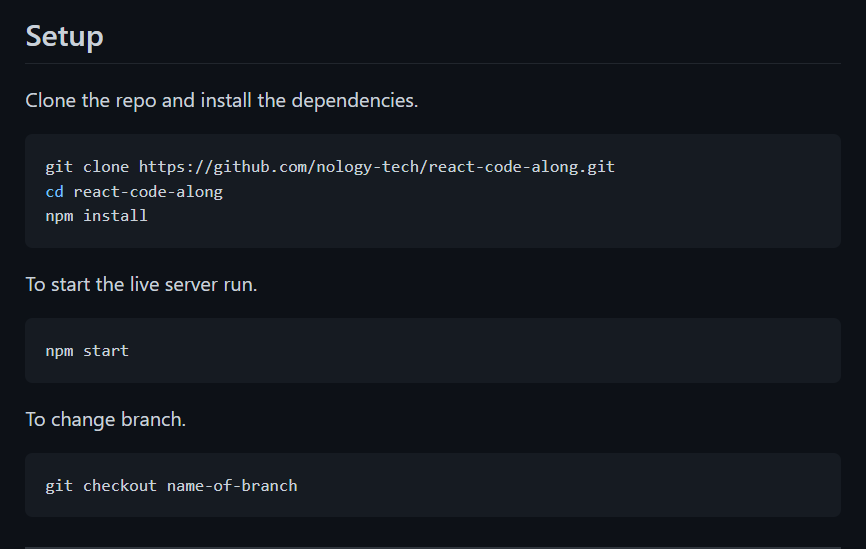

# Feedback

_Right click on the file and click Open Preview or `ctrl/cmd + shift + v` to open preview_

## Goals

1.  Working Calculator:

    - Yes 100% working calculator with lots of UI features added in.

2.  Practice using Git / Github Flow:

    - Yes, 8 branches and 35 meaningful commits! Amazing, keep it up.

3.  Application of what you are learning

- 110%, It looks great and you are still using SCSS etc which is great.
- I can see you using each of the topics we have covered so far in the JS. Except Classes but thats cool.
- You want to keep your main.scss file in your scss folder

---

## Specification

1. PSEUDOCODE - not sure

   - I am not sure if your comments are labelling the functionality or are the steps you took in breaking down the problem.
   - If it is pseudo code just move it to is own section in your readme.
     - Perhaps it is called "thought process" and you basically say you were working on decomposing a problem.

2. README - done

   - Yes it is done and looks amazing, you could add a set up section like below.



3. 15 commits - done

4. EVAL? - done

5. CAN'T EXPLAIN IT, YOU CANT USE IT - done

   - All good in terms of your code it is very readable and logical. I think if you had to you would be able to talk through it line by line.

---

## Overall

A solid calculator in terms of functionality and UX / UI. Good going mate, I can see piece of everything we have covered so far which is great. Your code reads well as well which is a bonus.

---

## To work on

This is just constructive so you do not have to implement it, its just to tie it up with bows and ribbons.

## Bugs

- Multiple decimals eg 5.5.5.5.5
- / 0 will give you infinity

## House keeping

- Remove comments / pseudo code

## Dry

There is a couple of places that you repeat logic / can simplify it.

Your code

```js
// lines 67 - 96
switch (operandCheck) {
  case operandCheck && operator.includes("+"):
    result = +firstOperand + +secondOperand;
    display.innerHTML += ` =  <span class="final-result">${result}</span> `;
    break;
  case operandCheck && operator.includes("-"):
    result = +firstOperand - +secondOperand;
    display.innerHTML += ` =  <span class="final-result">${result}</span> `;
    break;
  case operandCheck && operator.includes("x"):
    result = +firstOperand * +secondOperand;
    display.innerHTML += ` =  <span class="final-result">${result}</span> `;
    break;
  case operandCheck && operator.includes("÷"):
    result = +firstOperand / +secondOperand;
    display.innerHTML += ` =  <span class="final-result">${result}</span> `;
    break;
  case operandCheck && operator.includes("*"):
    result = Math.pow(+firstOperand, +secondOperand);
    display.innerHTML += ` =  <span class="final-result">${result}</span> `;
    break;
  case operandCheck && operator.includes("%"):
    result = (+firstOperand / 100) * +secondOperand;
    display.innerHTML += ` =  <span class="final-result">${result}</span> `;
    break;
  case operandCheck && operator.includes("√"):
    result = Math.sqrt(+firstOperand);
    display.innerHTML += ` =  <span class="final-result">${result}</span> `;
    break;
}
```

Could be

```js
switch (operandCheck) {
  case operandCheck && operator.includes("+"):
    result = +firstOperand + +secondOperand;
    break;
  case operandCheck && operator.includes("-"):
    result = +firstOperand - +secondOperand;
    break;
  case operandCheck && operator.includes("x"):
    result = +firstOperand * +secondOperand;
    break;
  case operandCheck && operator.includes("÷"):
    result = +firstOperand / +secondOperand;
    break;
  case operandCheck && operator.includes("*"):
    result = Math.pow(+firstOperand, +secondOperand);
    break;
  case operandCheck && operator.includes("%"):
    result = (+firstOperand / 100) * +secondOperand;
    break;
  case operandCheck && operator.includes("√"):
    result = Math.sqrt(+firstOperand);
    break;
}
display.innerHTML += ` =  <span class="final-result">${result}</span> `;
```
